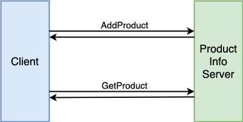

# grpc-up-and-running

 

This repository contains the Go source code of the book "[gRPC: Up and Running ((Kasun Indrasiri))](http://shop.oreilly.com/product/0636920282754.do)" and the personal summary of technical essentials about gRPC.

## Differences to The Original Source Code
- Add the detailed [instruction](docs/install_protocol_buffer_compiler.md) about how to install protocol buffer compiler.
- Flatten the source code by chapter into one application.
- Make sure the code is runnable (Fix some issues in the original source code).
- Better documentation.
- Add comments to make the code easy to read.

## Instructions
- [Install Protocol Buffer Compiler](docs/install_protocol_buffer_compiler.md)
- [Generate Server Stub](docs/generate_stub_go.md)
- [Build Executable File](docs/build_executable.md)

## Services And Remote Methods
### Product Info

| Method | Pattern | Description | 
|---|---|---|
| AddProduct | Unary RPC | Add a product. |
| GetProduct | Unary RPC | Get a product by product ID. |

### Order Management

| Method | Pattern | Description | 
|---|---|---|
| AddOrder | Unary RPC | Add a new order. |
| GetOrder | Unary RPC | Get a order by order ID. |
| SearchOrders | Server-side streaming | Get all the orders which has a certain item. |
| UpdateOrders | Client-side streaming | Update multiple orders. |
| ProcessOrders | Bidirectional streaming | Process multiple orders. <li>All the order IDs will be sent from client as a stream.<li>A combined shipment will contains all the orders which will be delivered to the same destination.<li>When the max batch size is reached, all the currently created combined shipments will be sent back to the client. |
