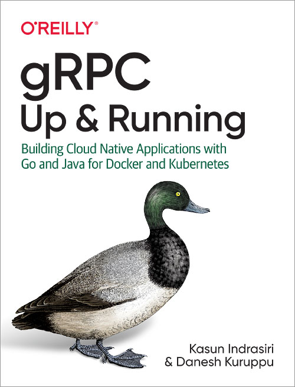
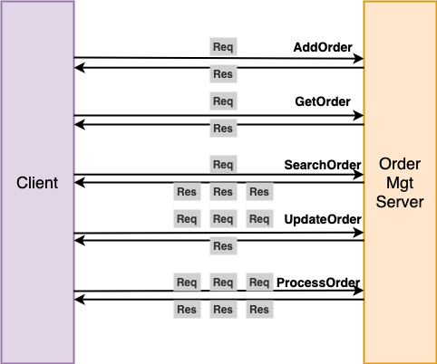

# grpc-up-and-running

 

The study note of the book "[gRPC: Up and Running (Kasun Indrasiri)](http://shop.oreilly.com/product/0636920282754.do)" and the reconstruction of source code.

## Study Notes
- [**Install Protocol Buffer Compiler**](docs/install_protocol_buffer_compiler.md)
- [**Generate Server Stub**](docs/generate_stub_go.md)
- [**Build Executable File**](docs/build_executable.md)
- [**Write Client Code**](docs/write_client.md)
- [**Write Server Code**](docs/write_server.md)
- [**Authentication**](docs/authentication.md)
   - [TLS Authentication](docs/authentication.md#tls-authentication)
      - [One-way TLS](docs/authentication.md#one-way-tls)
      - [Two-way TLS (mTLS)](#two-way-tls-mtls)
   - [Other Authentication Solutions](docs/authentication.md#other-authentication-solutions)
      - [Basic Authentication](docs/authentication.md#basic-authentication)
      - [OAuth 2.0](docs/authentication.md#oauth-20)
      - [JWT](docs/authentication.md#jwt)
      - [Google Token-Based Authentication](docs/authentication.md#google-token-based-authentication)

## Differences to The Original Source Code
- Add the detailed [instruction](docs/install_protocol_buffer_compiler.md) about how to install protocol buffer compiler.
- Add tutorials of writing server code and client code and modularize them by functionality.
- Flatten the source code by chapter into one application.
- Make sure the code is runnable (Fix some issues in the original source code).
- Better documentation.
- Add comments to make the code easy to read.

## Services And Remote Methods
### Product Info

| Method | Pattern | Description | 
|---|---|---|
| AddProduct | Unary RPC | Add a product. |
| GetProduct | Unary RPC | Get a product by product ID. |

### Order Management

| Method | Pattern | Description | 
|---|---|---|
| AddOrder | Unary RPC | Add a new order. |
| GetOrder | Unary RPC | Get a order by order ID. |
| SearchOrders | Server-side streaming | Get all the orders which has a certain item. |
| UpdateOrders | Client-side streaming | Update multiple orders. |
| ProcessOrders | Bidirectional streaming | Process multiple orders. <li>All the order IDs will be sent from client as a stream.<li>A combined shipment will contains all the orders which will be delivered to the same destination.<li>When the max batch size is reached, all the currently created combined shipments will be sent back to the client. |
