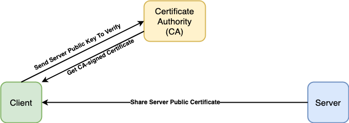
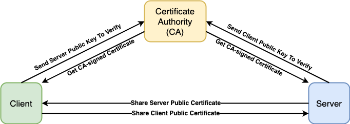

# Authentication

- [**TLS Authentication**](#tls-authentication)
   - [**One-way TLS**](#one-way-tls)
      - [**Server Code**](#server-code)
      - [**Client Code**](#client-code)
   - [**Two-way TLS (mTLS)**](#two-way-tls-mtls)
      - [**Basic Flow**](#basic-flow)
      - [**Server Code**](#server-code-1)
      - [**Client Code**](#client-code-1)
- [**Other Authentication Solutions**](#other-authentication-solutions)
   - [**Basic Auth**](#basic-authentication)
      - [**Server Code**](#server-code-2)
      - [**Client Code**](#client-code-2)
   - [**OAuth 2.0**](#oauth-20)
      - [**Server Code**](#server-code-3)
      - [**Client Code**](#client-code-3)
   - [**JWT**](#jwt)
      - [**Client Code**](#client-code-4)
   - [**Google Token-Based Authentication**](#google-token-based-authentication)
      - [**Client Code**](#client-code-5)

## TLS Authentication
### One-way TLS

- Only authenticate server identity.
- Only server shares public certificate.
#### Server Code
- Create a certificate object by parsing the pair of the server public certificate and the server private key.
  ```go
  cert, err := tls.LoadX509KeyPair("server.crt", "server.key")
  ```
- Add an server option to enable TLS for all incoming connections by adding certificates as TLS server credentials.
  ```go
  opts := []grpc.ServerOption{
      grpc.Creds(credentials.NewServerTLSFromCert(&cert)),
  }
  ```

#### Client Code
- Create a credential object by reading and parsing a public certificate.
  ```go
  creds, err := credentials.NewClientTLSFromFile("server.crt", "localhost")
  ```
- Add a dial option to include transport credentials.
  ```go
  opts := []grpc.DialOption{
      grpc.WithTransportCredentials(creds),
  }
  ```

### Two-way TLS (mTLS)

- Authenticate both server identity and client identity.
- Server and client share their public certificates with each other.

#### Basic Flow
- Client sends a request to access protected information from the server.
- The server sends its X.509 certificate to the client.
- Client validates the received certificate through a CA for CA-signed certificates.
- If the verification is successful, the client sends its certificate to the server.
- Server also verifies the client certificate through the CA.
- Once it is successful, the server gives permission to access protected data.

#### Server Code
- Create a certificate object by parsing the pair of the server public certificate and the server private key.
  ```go
  cert, err := tls.LoadX509KeyPair("server.crt", "server.key")
  ```
- Create a certificate pool.
  ```go
  certPool := x509.NewCertPool()
  ```
- Read and append the CA public certificate to the certificate pool.
  ```go
  ca, err := ioutil.ReadFile(caFile)
  certPool.AppendCertsFromPEM(ca)
  ```
- Add an server option to enable TLS for all incoming connections by creating TLS credentials.
  ```go
  opts := []grpc.ServerOption{
      grpc.Creds(
          credentials.NewTLS(&tls.Config {
              ClientAuth:   tls.RequireAndVerifyClientCert,
              Certificates: []tls.Certificate{cert},
              ClientCAs:    certPool,
          },
      )),
  }
  ```

#### Client Code
- Create a certificate object by parsing the pair of the client public certificate and the client private key.
  ```go
  cert, err := tls.LoadX509KeyPair("client.crt", "client.key")
  ```
- Read and append the CA public certificate to the certificate pool.
  ```go
  ca, err := ioutil.ReadFile(caFile)
  certPool.AppendCertsFromPEM(ca)
  ```
- Add a dial option to include transport credentials.
  ```go
  opts := []grpc.DialOption{
      grpc.WithTransportCredentials( credentials.NewTLS(&tls.Config{
          ServerName:   hostname,                // ServerName must be equal to the Common Name on the certificate.
          Certificates: []tls.Certificate{cert},
          RootCAs:      certPool,
      })),
  }
  ```
  
## Other Authentication Solutions
### Basic Authentication
- Use the user credentials (username and password) to authenticate.
- Request header: `Authorization: Basic YWRtaW46YWRtaW4=`.
- Cannot specify a validity period (When the username and password will be expired).

#### Server Code
- Implement an unary interceptor to decode the token and validate the credentials (username and password).
  ```go
  // The unary interceptor
  func ensureValidBasicCredentials(ctx context.Context, req interface{}, info *grpc.UnaryServerInfo, handler grpc.UnaryHandler) (interface{}, error) {
      md, ok := metadata.FromIncomingContext(ctx)
      if !ok {
          return nil, errMissingMetadata
      }
      if !valid(md["authorization"]) {
          return nil, errInvalidToken
      }
      // Continue execution of handler after ensuring a valid token.
      return handler(ctx, req)
  }

  // Validates the credentials.
  func valid(authorization []string) bool {
      if len(authorization) < 1 {
          return false
      }
      token := strings.TrimPrefix(authorization[0], "Basic ")
      return token == base64.StdEncoding.EncodeToString([]byte("admin:admin"))    // username = "admin", password = "admin"
  }
  ```
- Add the unary interceptor into the server option.
  ```go
  cert, err := tls.LoadX509KeyPair("server.crt", "server.key")
  opts := []grpc.ServerOption{
      grpc.Creds(credentials.NewServerTLSFromCert(&cert)),
      grpc.UnaryInterceptor(ensureValidBasicCredentials),
  }
  ```

#### Client Code
- Create a struct to hold the credentials.
  ```go
  type basicAuth struct {
      username string
      password string
  }
  ```
- Implement the interface of the struct.
  ```go
  // Convert user credentials to request metadata.
  func (b basicAuth) GetRequestMetadata(ctx context.Context, in ...string) (map[string]string, error) {
      auth := b.username + ":" + b.password
      enc := base64.StdEncoding.EncodeToString([]byte(auth))
      return map[string]string{
          "authorization": "Basic " + enc,
      }, nil
  }

  // Specify whether channel security is required to pass these credentials.
  func (b basicAuth) RequireTransportSecurity() bool {
      return true
  }
  ```
- Add a dial option to include the credentials.
  ```go
  creds, err := credentials.NewClientTLSFromFile("server.crt", "localhost")
  
  auth := basicAuth{
      username: "admin",
      password: "admin",
  }

  opts := []grpc.DialOption{
      grpc.WithPerRPCCredentials(auth),
      grpc.WithTransportCredentials(creds),
  }
  ```

### OAuth 2.0
- To access the resource, the client needs to get a token from the authorization server.
- To validate the token, the server needs to talk to the authorization server for validating the token.

#### Server Code
- Implement an unary interceptor to validate the token.
  ```go
  // The unary interceptor
  func ensureValidToken(ctx context.Context, req interface{}, info *grpc.UnaryServerInfo, handler grpc.UnaryHandler (interface{}, error) {
      md, ok := metadata.FromIncomingContext(ctx)
      if !ok {
          return nil, errMissingMetadata
      }
      if !valid(md["authorization"]) {
          return nil, errInvalidToken
      }
      return handler(ctx, req)
  }

  // Validates the token.
  func valid(authorization []string) bool {
      if len(authorization) < 1 {
          return false
      }
      token := strings.TrimPrefix(authorization[0], "Bearer ")
      return token == "abcd1234xyz"       // The correct token.
  }
  ```
- Add the unary interceptor into the server option.
  ```go
  cert, err := tls.LoadX509KeyPair("server.crt", "server.key")
  opts := []grpc.ServerOption{
      grpc.Creds(credentials.NewServerTLSFromCert(&cert)),
      grpc.UnaryInterceptor(ensureValidToken),
  }
  ```

#### Client Code
- Add a function to fetch the token from an authorization server (hardcoded token in the example).

  ```go
  func fetchToken() *oauth2.Token {
      return &oauth2.Token{
          AccessToken: "abcd1234xyz",   // hardcoded the token.
      }
  }
  ```
- Set up the credentials for the connection. 
  ```go
  auth := oauth.NewOauthAccess(fetchToken())
  ```
- Add a dial option to include the credentials.
  ```go
  creds, err := credentials.NewClientTLSFromFile("server.crt", "localhost")
  opts := []grpc.DialOption{
      grpc.WithPerRPCCredentials(auth),
      grpc.WithTransportCredentials(creds),
  }
  ```

### JWT
- To access the resource, the client needs to get a token from the authentication server.
- The resource server can validate the token by itself.

#### Client Code
- Create a credential object by reading and parsing the JWT token file.
  ```go
  jwtCreds, err := oauth.NewJWTAccessFromFile("token.json")
  ```
- Add a dial option to include the credentials.
  ```go
  creds, err := credentials.NewClientTLSFromFile("server.crt", "localhost")
  opts := []grpc.DialOption{
      grpc.WithPerRPCCredentials(jwtCreds),
      grpc.WithTransportCredentials(creds),
  }
  ```
  
### Google Token-Based Authentication
#### Client Code
